 

## 👋 About me

I'm a robotics and automation engineering student at **Thapar Institute, Patiala**. I like projects where software meets machines: a camera that catches defects on a towel line, a model that spots a pneumatic leak before it becomes a failure, a robot that finds its way around a restaurant.

📍 Patiala, Punjab, India &nbsp;|&nbsp; 📬 Best way to reach me: email

## 🏆 Highlights at a glance

| | |
|---|---|
| 🏭 **₹6,48,000 / month** | saved by a computer vision defect detector that replaced a six-person manual inspection at Trident Group |
| 🔬 **F1 0.986** | micro-leak detection model on FESTO pneumatic systems (R² 0.914 on hardware) |
| ☁️ **Top 10, Gold League** | Google Cloud GenAI Hackathon, Phase 1 |
| 🎓 **₹2,00,000** | Merit Scholarship for academic excellence |
| 📄 **TICSR 2026** | research presented, abstract published, full paper under peer review |

## 💼 Experience (click to expand)

<b>🏭 Engineering Intern, Trident Group</b> &nbsp;·&nbsp; Jun – Aug 2026

 

- Built and deployed a **computer vision defect detection system** for towel quality inspection (Python, OpenCV). It replaced a six-person manual process across 8-hour shifts, saving about ₹6,48,000 a month.
- Led setup, installation and commissioning of a **CCCH Lockstitch Texpa Cross Hemming machine** with German engineering experts.
- Owned daily **preventive maintenance audits** for CSP line machinery against OEM documentation.
- Got hands-on exposure to **SAP** in a live plant.
- Built all the Python and AI tooling myself in VS Code, since the corporate setup was limited to MS365.

<b>🔬 Undergraduate Research Fellow, Thapar Institute</b> &nbsp;·&nbsp; Jan – May 2026

 

**Physics-Aware AI for Early Micro-Leak Prognosis in FESTO Pneumatic Systems** (₹20,000 fellowship)

- Built a hybrid **FluidSIM + real FESTO hardware** setup with Siemens S7 PLC integration.
- Full ML pipeline: ingestion, preprocessing, feature engineering, and a **VotingClassifier** (Random Forest + Gradient Boosted Trees).
- **F1 0.986** in simulation, **R² 0.914** on hardware regression.
- Presented at **TICSR 2026**.

<b>🌐 Full Stack Developer, Yog Sadhna Kendra Ferozepur (NGO)</b> &nbsp;·&nbsp; Jun – Aug 2025

 

- Built and deployed a responsive web app: **React** frontend, **Flask** backend, REST APIs.
- Gathered requirements from non-technical stakeholders and delivered on time.
- Improved load speed and accessibility.

<b>🚁 Summer Intern, Thapar Institute</b> &nbsp;·&nbsp; Jun – Aug 2024

 

- Designed an automated **quadcopter** with IR sensors, Zigbee and embedded controllers for real-time environmental data collection (MATLAB, Python).
- Awarded **best project** of the ELC Summer Internship.

## 🚀 Featured projects

<table>
<tr>
<td width="50%" valign="top">

### 🧾 Logbook
Full stack career tracking platform. Next.js, Supabase/Postgres, Vercel.
- Auth with email, Google and GitHub OAuth, plus row-level security
- ETL pipeline seeding **1,000+ real job postings**
- Gemini API turns raw input into resume content and posts
- Skill gap ranking based on real job posting data

</td>
<td width="50%" valign="top">

### 📰 AI News Agent
Two-step agentic RAG with Gemini 2.5 Flash and Tavily.
- Every claim in a summary links to a source citation
- Uncited claims are dropped in code
- FastAPI, React/Vite, SQLite TTL cache, pytest with mocked LLM calls

</td>
</tr>
<tr>
<td width="50%" valign="top">

### 🤖 LinkedIn Auto-Poster Agent
Turns GitHub repos into LinkedIn posts, with me approving each one on Telegram.
- Groq/Llama 3.3, LinkedIn UGC API, OAuth2
- Idempotent polling with offset tracking
- Runs fully serverless on GitHub Actions

</td>
<td width="50%" valign="top">

### 🙂 SmartFace
Face recognition attendance system. Python, FastAPI, React, OpenCV.
- Live webcam, live photo and group photo recognition
- 7 to 8 samples per student for better accuracy
- Group-wise matrices, dataset import/merge, `.xlsx` export

</td>
</tr>
<tr>
<td width="50%" valign="top">

### 🦾 Autonomous Mobile Robot
ROS2, Gazebo, Python, C++ with a custom URDF.
- SLAM, LaserScan processing, odometry localization
- PID navigation plus manual teleoperation
- Restaurant-style simulated environment

</td>
<td width="50%" valign="top">

### ☁️ Google Cloud GenAI Hackathon
**Top 10, Gold League, Phase 1.** Five GenAI apps on Vertex AI, Gemini, Imagen, Docker and Cloud Run.
- Multimodal RAG, document intelligence, semantic search, agentic workflow, AI assistant
- About 40% automation improvement across use cases

</td>
</tr>
</table>

<b>More projects</b>

 

- **AI Chatbot**: Gradio + Hugging Face Transformers, memory use cut by 45% for CPU-only inference, live on Hugging Face Spaces
- **Face Recognition Attendance**: LBPH + OpenCV, 92% recognition accuracy
- **Predictive Maintenance Classification**: XGBoost, Random Forest, SVM, about 18% accuracy gain over an untuned baseline
- **Sentiment Analysis**: VADER on 10,000+ reviews, 91% accuracy
- **Fake News Detection**: BERT with PyTorch and Hugging Face, Flask app integrated with Azure
- **Autonomous Buggy**: IR + Zigbee transmitter/receiver boards
- **Truss Design**: fabricated truss that held a 6.8 kg load

## 🛠️ Tech stack

  
    
  

| | |
|---|---|
| **AI / GenAI** | LLM APIs (Gemini, Vertex AI, Groq), RAG, agentic workflows, Azure Voice Live API, Microsoft Foundry, Hugging Face, LangChain |
| **ML / Vision** | XGBoost, Random Forest, scikit-learn, OpenCV, feature engineering |
| **Robotics** | ROS2, Gazebo, RViz, SLAM, Nav2, PID, sensor fusion |
| **Hardware / CAD** | Creo, AutoCAD, FluidSIM, 8051, Siemens S7 PLC |
| **Tools** | GitHub Actions, Cloud Run, n8n, Power BI, Tableau, pytest |

## 📜 Recognition

- 🥇 Top 10, Gold League, Google Cloud GenAI Hackathon
- 👥 Team Lead, Adobe Hackathon (AI Document Summarizer), cleared round one
- ✅ Cleared the internal college round of Smart India Hackathon
- 🧠 Founding Member, Society of Intelligent Systems, Thapar
- 💻 150+ LeetCode problems solved
- 🌱 Open source: merged a decimal-comma cleaning utility into **Smart House Research Toolkit** (PR #23, 8 unit tests)
- 📘 McKinsey Forward Program graduate
- ☁️ Microsoft Foundry / Azure Speech and Language certifications

## 📊 GitHub stats

<picture>
  <source media="(prefers-color-scheme: dark)" srcset="https://raw.githubusercontent.com/YOUR_USERNAME/YOUR_USERNAME/output/github-snake-dark.svg"/>
  
</picture>

### 🤝 Hiring or building something interesting? Let's talk.

